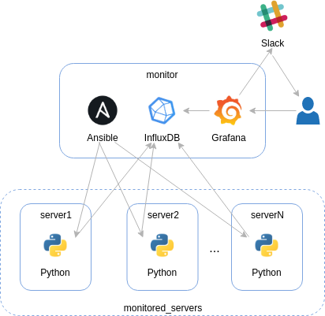

# Get metrics for alerting in advance and preventing trouble

This solution is explained in detail in the Codeyourinfra project blog post [How to get metrics for alerting in advance and preventing trouble](http://codeyourinfra.today/how-to-get-metrics-for-alerting-in-advance-and-preventing-trouble). Check it out!

## Problem

You may already have a monitoring solution. After all, you are responsible for keeping all the IT services available. You don't want to be surprised by an unexpected outage, then you install in every server an agent for collecting relevant data for monitoring purposes. In addition, automatic emails are sent if something is going wrong, you've configured that. The problem is that you can't handle it anymore because you now have more than a thousand of servers to be monitored. Furthermore, people no more give attention to the alerts received by email, due to the big amount of false positive ones.

## Solution

The solution is based on [InfluxDB](https://docs.influxdata.com/influxdb), a high performance time series database, on [Grafana](https://grafana.com/), a time series analytics and monitoring tool, and on [Ansible](https://www.ansible.com/), an agentless automation tool. They are all open source tools and can be easily integrated with each other in order to create a monitoring service. With Ansible is possible to extract the servers' hardware metrics and store them in the InfluxDB ([playbook-get-metrics.yml](templates/playbook-get-metrics.yml)). With Grafana is possible to connect to InfluxDB and show the metrics in a graphical way, define thresholds and configure alerts that can be given through different channels, including instant messaging apps like [Slack](https://slack.com) and [Telegram](https://telegram.org).

## Test

First of all, run the command `vagrant up monitor`, in order to turn on the **monitoring server**. Then, open your web browser and access the Grafana web application through the **URL** <http://192.168.33.10:3000>. The **user** and the **password** are *admin*. After that, click in the **used_mem_pct** dashboard. You will see the **Used memory percentage** line chart, with data from the **monitoring server** itself. An alert is sent to a [Slack workspace](https://mygrafanaalerts.slack.com) (click [here](https://join.slack.com/t/mygrafanaalerts/shared_invite/enQtNjg2NTQ0MDM0MDgxLTA3NzhkNjliNjY5YWUwNTY1OWI3MjkwOGIwZjM2NDQzNzlhMDc3YjQzMjg0Mjc4MjYzYjYyNjc2MjQ5ZDA3OGU) to join) if the last 5 used memory percentage values are grater than or equal to 95%, the defined threshold.

You can add the other servers to the monitoring service, if you want. In order to add the **server1**, firstly boot it up, through the command `vagrant up server1`. After that, execute the command `ansible-playbook playbook-add-server.yml -e "host=192.168.33.20 user=vagrant password=vagrant"`. The parameters **host**, **user** and **password** are used by Ansible to access the monitored hosts, through SSH, from the monitoring server. Once added, wait at least 1 minute and check if Ansible is properly getting the metrics from the new monitored server by executing the ad-hoc command `ansible monitor -m shell -a "cat /etc/ansible/playbooks/playbook-get-metrics.log"`. Repeat these steps for the **server2**, at your will.

### Automated tests

You can also test the solution automaticaly, by executing `./test.sh` or using [Molecule](https://molecule.readthedocs.io). With the latter, you can perform the test not only locally (the default), but in [AWS](https://aws.amazon.com) as well. During the Codeyourinfra's *continuous integration* process in Travis CI, the solution is tested on [Amazon EC2](https://aws.amazon.com/ec2).

In order to get your environment ready for using *Molecule*, prepare your [Python virtual environment](https://docs.python.org/3/tutorial/venv.html), executing `python3 -m venv env && source env/bin/activate && pip install -r ../requirements.txt`. After that, just run the command `molecule test`, to test the solution locally in a [VirtualBox](https://www.virtualbox.org) VM managed by [Vagrant](https://www.vagrantup.com).

If you prefer performing the test in AWS, bear in mind you must have your credentials appropriately in **~/.aws/credentials**. You can [configure it through the AWS CLI tool](https://docs.aws.amazon.com/cli/latest/userguide/cli-chap-configure.html). The test is performed in the AWS region *Europe - London (eu-west-2)*. Just run `molecule test -s aws` and check the running instances through your [AWS Console](https://eu-west-2.console.aws.amazon.com/ec2/v2).
